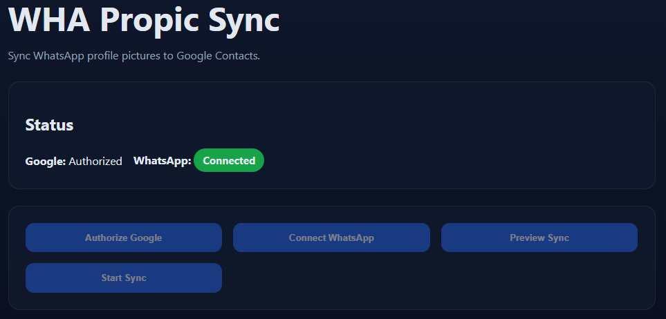

# 📱 WhatsApp Profile Picture Sync to Google Contacts



Sync WhatsApp profile pictures to your Google Contacts automatically! 🚀

This app connects to your WhatsApp and Google accounts to automatically update contact photos in Google Contacts with the latest WhatsApp profile pictures.


## ✨ Features

- 🔐 Secure OAuth authentication for Google
- 📱 WhatsApp Web integration via Baileys
- 👀 Preview contacts before syncing
- 📊 Real-time progress tracking
- 🐳 Docker support for easy deployment

## 🚀 Quick Start

### Prerequisites

- Node.js 18+
- Google Cloud Console account
- WhatsApp account

### Setup

1. **Clone the repository**
   ```bash
   git clone https://github.com/cchrkk/wha-propic-sync.git
   cd wha-propic-sync
   ```

2. **Install dependencies**
   ```bash
   npm install
   ```

3. **Configure Google OAuth**
   - Go to [Google Cloud Console](https://console.cloud.google.com/)
   - Create a new project or select existing one
   - Enable the **Google People API**
   - Create OAuth 2.0 credentials
   - Add `http://localhost:3000/oauth2callback` as authorized redirect URI

4. **Configure environment**
   ```bash
   cp .env.example .env
   # Edit .env with your Google credentials
   ```

5. **Run the app**
   ```bash
   npm run dev
   ```
   Open [http://localhost:5173](http://localhost:5173) in your browser

## 🐳 Docker Setup

### Build and run with Docker

```bash
# Build the image
docker build -t wha-propic-sync .

# Run the container
docker run -p 3000:3000 -p 5173:5173 wha-propic-sync
```

### Using Docker Compose

```bash
docker-compose up --build
```

## 📋 Configuration

The `.env` file should contain:

```env
GOOGLE_CLIENT_ID=your-client-id.apps.googleusercontent.com
GOOGLE_CLIENT_SECRET=your-client-secret
GOOGLE_REDIRECT_URI=http://localhost:3000/oauth2callback
DEFAULT_COUNTRY_CODE=+39
```

## 🔧 Development

### Available Scripts

- `npm run dev` - Start development server with hot reload
- `npm run build` - Build for production
- `npm start` - Start production server

### Project Structure

```
src/
├── client/          # React frontend
├── google-auth.js   # Google OAuth handling
├── whatsapp-client.js # WhatsApp connection
├── contact-sync.js  # Sync logic
└── index.js         # Express server
```

## 🔒 Security

- OAuth tokens are stored locally in `tokens.json`
- WhatsApp session stored in `whatsapp-session/` folder
- Never commit sensitive files to version control

## 🤝 Contributing

1. Fork the repository
2. Create your feature branch (`git checkout -b feature/amazing-feature`)
3. Commit your changes (`git commit -m 'Add some amazing feature'`)
4. Push to the branch (`git push origin feature/amazing-feature`)
5. Open a Pull Request

## 📄 License

This project is licensed under the MIT License - see the [LICENSE](LICENSE) file for details.

## ⚠️ Disclaimer

This project is not affiliated with WhatsApp or Google. Use at your own risk. Make sure to comply with WhatsApp's Terms of Service and Google's API policies.
